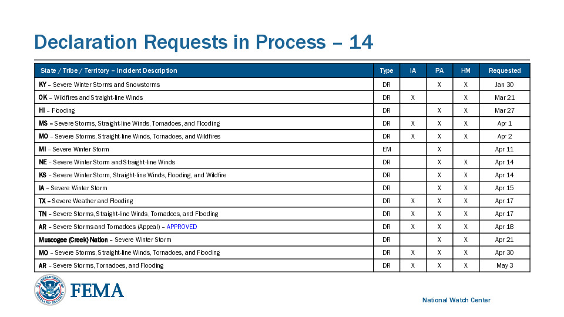

# Extract FEMA incidents

Extracting data from a .pdf or .jpg of a table. Suggested by Simon Wilison at his [PyCon 2025 talk about building software with LLMs](https://building-with-llms-pycon-2025.readthedocs.io/en/latest/structured-data-extraction.html#something-a-bit-more-impressive).

The table is on page 9 of <a href="fema-daily-operation-brief.pdf" download>this pdf</a>. Here is the .jpg version:



```js
import sparkBar from "../../components/sparkBar.js"
import jsonDiff from "../../components/jsonDiff.js"
const results = FileAttachment("results/results.csv").csv({ typed: true })
const aggregate = FileAttachment("results/aggregate.csv").csv({ typed: true })
```

## Aggregate

```js
Inputs.table(aggregate, {
  sort: "share_correct",
  reverse: true,
  format: {
    share_correct: sparkBar(1),
  },
  align: {
    share_correct: "center",
  },
})
```

## Results

```js
const extractJSONStrings = (text) => {
  const jsonRegex = /Expected output "(.*)" to equal "(.*)"/
  const matches = text.match(jsonRegex)

  if (matches.length < 3) {
    throw new Error("Could not find two JSON arrays in the input")
  }

  try {
    return [
      _.sortBy(JSON.parse(matches[1]), [
        "state_or_tribe_or_territory",
        "requested",
      ]),
      _.sortBy(JSON.parse(matches[2]), [
        "state_or_tribe_or_territory",
        "requested",
      ]),
    ]
  } catch (err) {
    throw new Error("Failed to parse one of the JSON arrays: " + err.message)
  }
}

const resultToDiff = (text) => {
  try {
    const [actual, expected] = extractJSONStrings(text)
    return jsonDiff(expected, actual)
  } catch (err) {
    return htl.html`<i>Error parsing results</i>`
  }
}

const resultsTransposed = results
  .map((row) => {
    const modelKeys = Object.keys(row).filter((d) => d.startsWith("["))

    return modelKeys.map((d) => {
      let output
      try {
        output = JSON.stringify(extractJSONStrings(row[d])[1])
      } catch (err) {
        output = "Pass"
      }

      return {
        model: d.match(/\[(.*)\]/)[1],
        attachments: row.attachments,
        raw: row[d],
        correct: row[d].includes("PASS"),
      }
    })
  })
  .flat()
```

```js
const selection = view(
  Inputs.table(resultsTransposed, {
    format: {
      correct: (x) =>
        x
          ? htl.html`<div style="background: #d5edca;">✔</div>`
          : htl.html`<div style="background: #f9dddb;">✗</div>`,
    },
    align: { correct: "center" },
    required: false,
    multiple: false,
  }),
)
```

```js
if (selection) {
  display(htl.html`<h3>${selection.model}</h3>`)
  const keys = Object.keys(selection).filter((d) =>
    ["attachments", "raw"].includes(d),
  )
  for (const key of keys) {
    display(
      Inputs.textarea({ label: key, value: selection[key], readonly: true }),
    )
    display(htl.html`<br/>`)
  }

  if (!selection.correct) {
    const [actual, expected] = extractJSONStrings(selection.raw)
    display(
      Inputs.textarea({
        label: "actual",
        value: JSON.stringify(actual),
        readonly: true,
        monospace: true,
      }),
    )
    display(htl.html`<br/>`)
    display(
      Inputs.textarea({
        label: "expected",
        value: JSON.stringify(expected),
        readonly: true,
        monospace: true,
      }),
    )
    display(htl.html`<br/>`)
  }

  display(htl.html`<h4>JSON diff</h4>`)
  display(htl.html`<p>Red is expected; Green is actual</p>`)
  display(resultToDiff(selection.raw))
} else {
  display(htl.html`<i>Click a row above to see all details</i>`)
}
```
