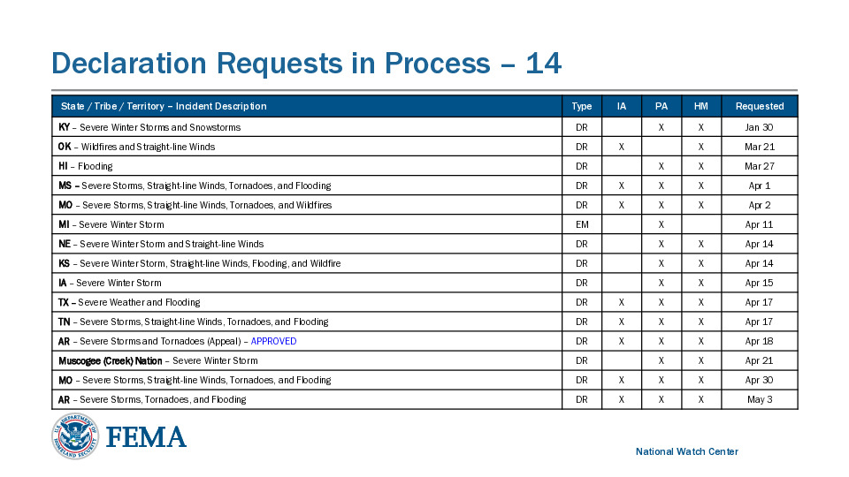

Extracting data from a .pdf or .jpg of a table. Suggested by Simon Willison at his [PyCon 2025 talk about building software with LLMs](https://building-with-llms-pycon-2025.readthedocs.io/en/latest/structured-data-extraction.html#something-a-bit-more-impressive).

The table is on page 9 of <a href="fema-daily-operation-brief.pdf" download>this pdf</a>. Here is the .jpg version:

