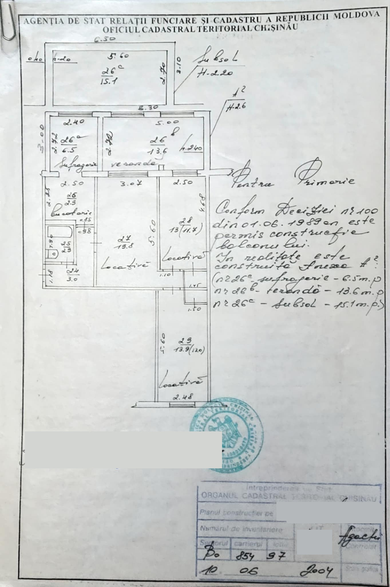

# OCR and translation task

Combining OCR and translation from a .jpg with both typed and handwritten words. Image from [Remote Labor Index](https://www.remotelabor.ai/).

[View on GitHub](https://github.com/kevinschaul/llm-evals/tree/main/src/evals/extract-fema-incidents)



```js
import AggregateTable from "../../components/AggregateTable.js"
import ResultsTable from "../../components/ResultsTable.js"
import SelectionDetails from "../../components/SelectionDetails.js"
const results = FileAttachment("results/results.csv").csv({ typed: false })
const aggregate = FileAttachment("results/aggregate.csv").csv({ typed: true })
```

## Aggregate

```js
AggregateTable(aggregate)
```

## Results

```js
const selection = view(ResultsTable(results))
```

```js
SelectionDetails(selection, display)
```
